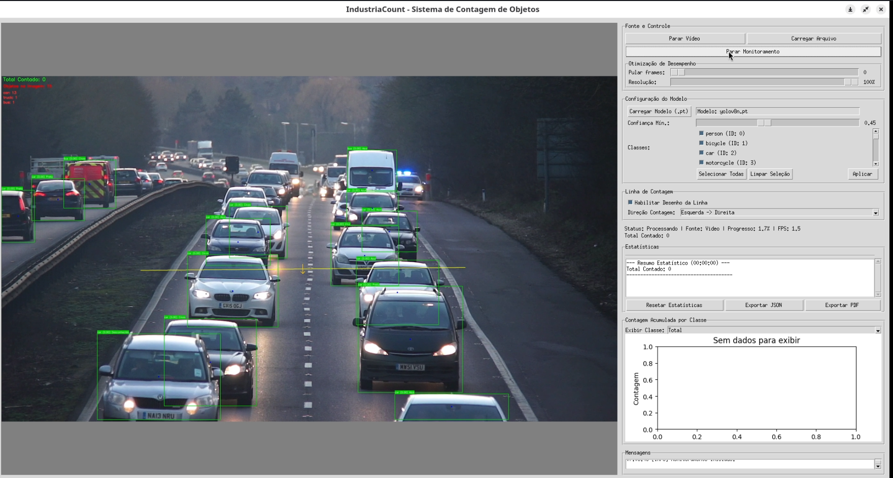

# IndustriaCount - Sistema de Contagem de Objetos

Um sistema avançado de visão computacional para contagem automática de objetos em ambientes industriais, utilizando tecnologia YOLO para detecção e rastreamento com alta precisão.


## 🔍 Características Principais

- **Detecção Inteligente**: Modelos YOLO de última geração detectam objetos com alta precisão em tempo real
- **Rastreamento Avançado**: Algoritmos sofisticados mantêm a identidade dos objetos entre frames
- **Contagem Direcional**: Define linhas virtuais para contagem com direção personalizada
- **Análise em Tempo Real**: Dashboard com estatísticas detalhadas atualizadas instantaneamente
- **Classificação por Cor**: Identifica e segmenta objetos automaticamente por características cromáticas
- **Interface Intuitiva**: Design moderno e funcional construído com Tkinter
- **Visualização Dinâmica**: Gráficos interativos com histórico e tendências de produção
- **Gerenciamento de Modelos**: Biblioteca integrada para download e seleção de modelos YOLO


## 🏗️ Estrutura do Projeto

```
IndustriaCount/
├── models/                  # Biblioteca de modelos YOLO
├── output/                  # Armazenamento de resultados e relatórios
├── src/                     # Núcleo de código-fonte
│   ├── core/                # Motor de processamento
│   │   ├── model_manager.py # Gerenciamento de modelos AI
│   │   ├── statistics.py    # Processamento estatístico
│   │   └── tracker.py       # Sistema de rastreamento
│   ├── ui/                  # Componentes de interface
│   │   ├── app.py           # Aplicação principal
│   │   └── ui_components.py # Elementos visuais modulares
│   └── utils/               # Ferramentas auxiliares
│       └── image_processing.py # Processadores de imagem
├── cont_instancia_line.py   # Script legado (compatibilidade)
├── download_models.py       # Gerenciador de download
├── main.py                  # Ponto de entrada do aplicativo
└── requirements.txt         # Dependências do sistema
```

## 🚀 Requisitos de Sistema

- Python 3.8 ou superior
- OpenCV para processamento de imagem
- PyTorch como backend de IA
- Ultralytics para modelos YOLO
- Numpy para computação numérica
- Tkinter para interface gráfica
- Pillow para manipulação de imagens
- Matplotlib para visualização de dados
- Rich para interfaces CLI elegantes
- Requests para comunicação HTTP
- tqdm para indicadores de progresso

## ⚙️ Instalação

1. Clone o repositório em sua máquina:

   ```bash
   git clone https://github.com/jpedrops092/ContarObjetosCV.git
   cd IndustriaCount
   ```
2. Configure o ambiente com as dependências necessárias:

   ```bash
   pip install -r requirements.txt
   ```
3. Baixe os modelos YOLO pré-treinados (recomendado):

   ```bash
   python download_models.py
   ```

## 🖥️ Como Usar

1. Inicie o sistema com:

   ```bash
   python main.py
   ```
2. Na interface do usuário:

   - Selecione um modelo YOLO da biblioteca
   - Conecte uma webcam ou carregue um arquivo de mídia
   - Defina uma linha de contagem com a ferramenta de desenho
   - Configure a direção de contagem desejada
   - Inicie o monitoramento para coletar dados em tempo real

## 📚 Gerenciamento de Modelos

O sistema inclui uma ferramenta dedicada para gerenciar modelos de IA:

```bash
python download_models.py
```

Esta ferramenta oferece:

- Catálogo de modelos YOLO otimizados para diferentes cenários
- Avaliação comparativa de desempenho
- Download com verificação de integridade
- Gerenciamento de versões e atualizações

## 📊 Visualização de Dados

IndustriaCount gera relatórios detalhados que incluem:

- Contagens totais e por categoria
- Taxas de produção por período
- Distribuição de objetos por características
- Identificação de anomalias e tendências

## 📄 Licença

Este projeto é disponibilizado sob a licença MIT, permitindo uso comercial e modificações.

## 🤝 Contribuições

Sua contribuição é bem-vinda! Para participar:

- Reporte issues para identificar bugs ou sugerir melhorias
- Envie pull requests com novas funcionalidades ou correções
- Compartilhe estudos de caso e exemplos de implementação

---

**IndustriaCount**: Transformando visão computacional em inteligência industrial.
